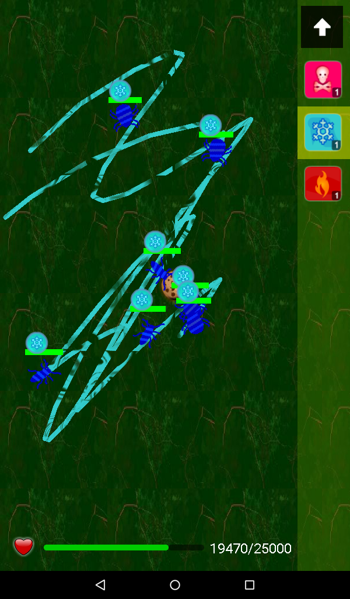
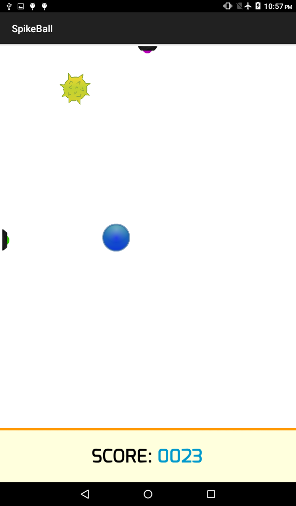
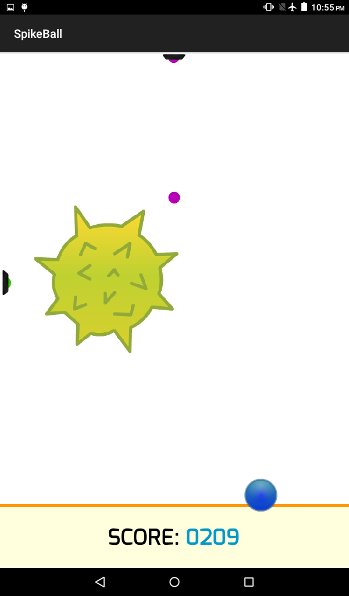
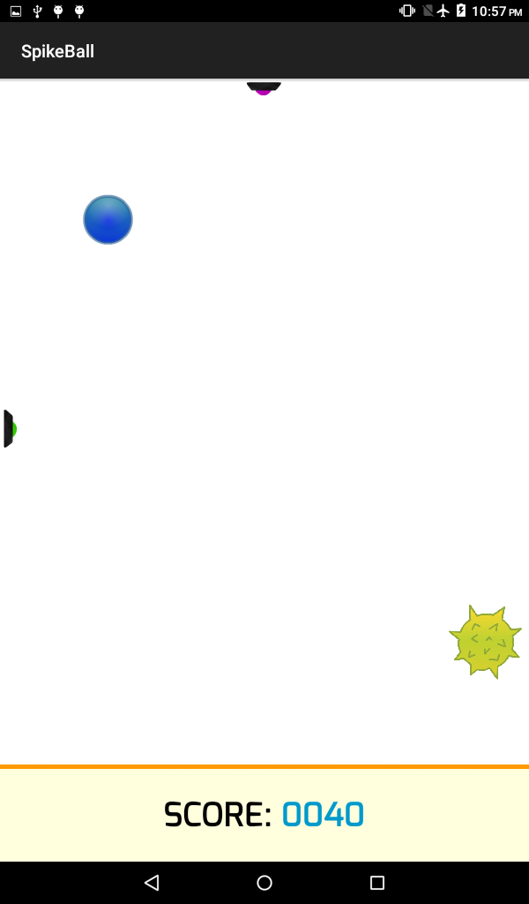
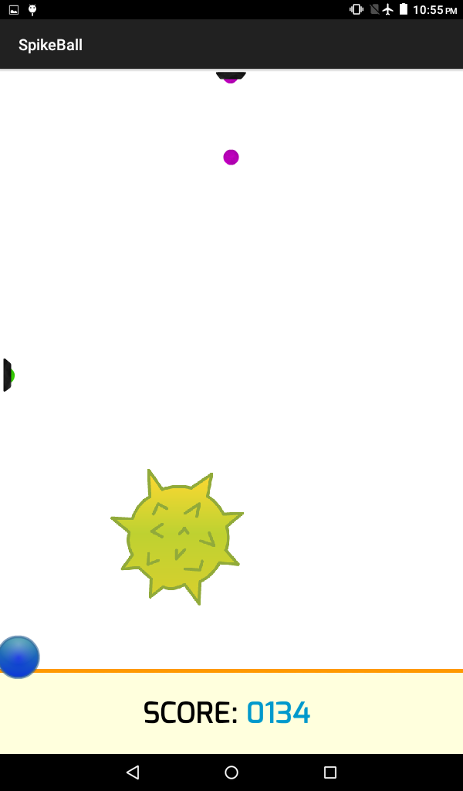
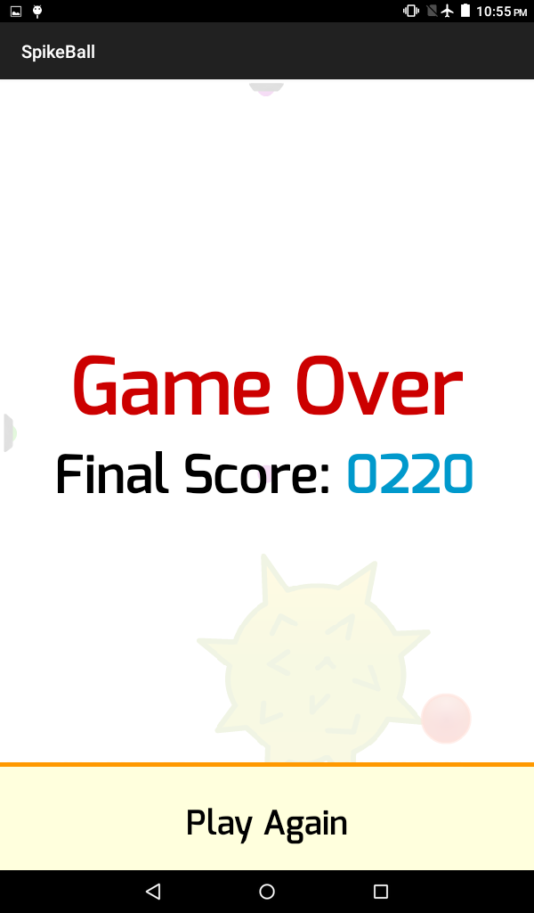

# GameDevelopment
A few Android games I've developed. Best suitable for larger screens/tablets.

## SwampMaster
### Overview
Swamp Master engages you in a fast-paced and entertaining strategy game. In each level, you will find new bugs, each of which has different strength to resist against the swamps. The bugs will all try to get at the cookie placed at the center of the field. It is up to you to defend the cookie from the vicious bugs by "drawing" different sorts of swamps around the field. Each swamp is unique in its own way and uses different effects such as poisoning, freezing, burning or paralyzing to deter and kill the bugs.

As the bugs cross over these swamps, they will be injured and after their health is done, they die. It is up to you to create as many swamps and of different types to prevent all the bugs from getting at your precious cookie. It is up to you to truly become the Swamp Master! 

<table>

<tr>
<td>

</td>
<td>

</td>
<td>

</td>
</tr>

<tr>
<td>

</td>
<td>

</td>
<td>

</td>
</tr>

<tr>
<td>

</td>
<td>

</td>
<td>

</td>
</tr>

</table>

## SpikeBall
### Overview
SpikeBall is a fast-paced, simple yet addicting game! Your character is a blue ball that will move wherever you click on the screen. There is also a yellow-colored spike ball that is constantly moving, bouncing off the walls. Unlike your character, the spike ball is constantly getting bigger and bigger. Your objective: stay away from the spike ball for as long as possible! Your score is directly linked to how long you can avoid getting hit!

There are also two distractor cannons on the top and left. These will randomly shoot out pellets and if the spike ball hits a pellet it will change its direction so watch out for those!

<table>

<tr>
<td>

</td>
<td>

</td>
<td>

</td>
</tr>

<tr>
<td>

</td>
<td>

</td>
<td>
</td>
</tr>

</table>